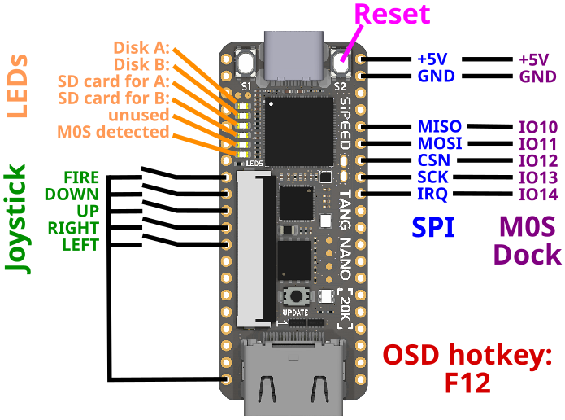

# MiSTeryNano

The MiSTeryNano is a port of the
[MiSTery Atari STE FPGA core](https://github.com/gyurco/MiSTery) to the
[Tang Nano 20k FPGA board](https://wiki.sipeed.com/nano20k).


## Current state

The MiSTeryNano is a work in progress. Current features are:

  * Atari ST/STE
    * Complete Atari ST/E chipset
    * ST or STE configurable
    * Cycle exact 8 MHz 68000 CPU
    * 4MB RAM, optional 8MB STRAM
    * color and monochrome video via HDMI
    * YM2149 and STE DMA sound via HDMI
    * Blitter
  * Supports most TOS versions
  * Full IKBD implementation
    * Mapped to USB via BL616 MCU
    * Mouse and keyboard via USB
    * Joystick via USB or dedicated IO pins of Tang Nano 20k
  * Floppy disk images
    * Read and write support for drive A: and drive B:
    * Images stored on regular FAT/exFAT formatted SD card

## Videos

These videos primarily document the progress during development:

  * [MiSTeryNano #1: Is the Tang Nano 20k the cheapest and smallest Atari ST?](https://www.youtube.com/shorts/qndojsbH9jw)
  * [MiSTeryNano #2: Booting TOS 1.04 for the first time](https://www.youtube.com/shorts/yLxXRR_04UE)
  * [MiSTeryNano #3: We got a rainbow!](https://www.youtube.com/shorts/9wFxQvKtOY8)
  * [MiSTeryNano #4: Drives and Blitter](https://www.youtube.com/shorts/FfL01D0Zg0o)
  * [MiSTeryNano #5: Playing Atari ST Frontier](https://www.youtube.com/shorts/xJHF-LlaHFo)
  * [MiSTeryNano #6: B.I.G. DEMO](https://www.youtube.com/shorts/EXPfdhlpuFI)
  * [MiSTeryNano #7: Tang Nano 20k running Atari ST Oxyd2](https://www.youtube.com/shorts/Ud1P1vE5j84)
  * [MiSTeryNano #8: Atari ST with USB keyboard and touchpad](https://www.youtube.com/shorts/jjps1x1NjhE)
  * [MiSTeryNano #9: Tang Nano 20k as USB host](https://www.youtube.com/shorts/bP5gK3nmv-o)
  * [MiSTeryNano #10: New OSD for the FPGA Atari ST](https://www.youtube.com/shorts/zsHYcolqtpc)
  * [MiSTeryNano #11: Advanced SD card for FPGA Atari ST](https://www.youtube.com/shorts/NP1EnRj4Fk0)

## Getting started

In order to use the MiSTeryNano the following things are needed:

  * [Tang Nano 20k FPGA board](https://wiki.sipeed.com/nano20k) to run the MiSTeryNano core
  * [M0S Dock](https://wiki.sipeed.com/hardware/en/maixzero/m0s/m0s.html) to connect USB keyboard and mouse
  * a breadboard to wire everything up
  * some jumper wires
  * a USB-C to USB-A adapter to connect regular USB devices to the M0S Dock


MiSTeryNano has been developed and tested under Linux. Thus the following
explanations expect a Linux system to be used. The installation consists
of four steps:

### Step 1: Installation of the core

Use [openFPGAloader](https://github.com/trabucayre/openFPGALoader) to install the MiSTeryNano core named [```atarist.fs```](https://github.com/harbaum/MiSTeryNano/releases) on your Tang Nano 20k:

```
$ openFPGALoader -f atarist.fs 
write to flash
Jtag frequency : requested 6.00MHz   -> real 6.00MHz  
Parse file Parse ../atarist/impl/pnr/atarist.fs: 
Done
DONE
Jtag frequency : requested 2.50MHz   -> real 2.00MHz  
Jtag frequency : requested 10.00MHz  -> real 6.00MHz  
erase SRAM Done
Detected: Winbond W25Q64 128 sectors size: 64Mb
Detected: Winbond W25Q64 128 sectors size: 64Mb
RDSR : 00
WIP  : 0
WEL  : 0
BP   : 0
TB   : 0
SRWD : 0
00000000 00000000 00000000 00
Erasing: [==================================================] 100.00%
Done
Writing: [==================================================] 100.00%
Done
```

### Step 2: Installation of the TOS image(s)

Most TOS images should be supported by now. This has been tested with
US TOS 1.00 (60 Hz NTSC video) and german TOS 1.04 and TOS 2.06 (both
50 Hz PAL video).

This needs to be flashed into the flash ROM of the Tang Nano 20k at
1MB offset:

```
$ openFPGALoader --external-flash -o 1048576 tos104de.img
write to flash
Jtag frequency : requested 6.00MHz   -> real 6.00MHz  
Parse file DONE
Jtag frequency : requested 2.50MHz   -> real 2.00MHz  
Jtag frequency : requested 10.00MHz  -> real 6.00MHz  
erase SRAM Done
Detected: Winbond W25Q64 128 sectors size: 64Mb
Detected: Winbond W25Q64 128 sectors size: 64Mb
RDSR : 00
WIP  : 0
WEL  : 0
BP   : 0
TB   : 0
SRWD : 0
00100000 00000000 00000000 00
Erasing: [==================================================] 100.00%
Done
Writing: [==================================================] 100.00%
Done
```

Now the MiSTeryNano should already boot into the TOS desktop in ST mode.

For STE mode a STE capable TOS needs to be flashed to a different flash
location:

```
$ openFPGALoader --external-flash -o 1310720 tos206de.img
```

This TOS image is always use when STE mode is selected.

### Step 3: Installation of the MCU firmware

Release V1.2.0 of MiSTeryNano expects a [M0S
Dock](https://wiki.sipeed.com/hardware/en/maixzero/m0s/m0s.html) to be
used for USB connectivity and system control. The
```misterynano_fw_bl616_cfg.ini``` and ```misterynano_fw_bl616.bin```
files from the [release
page](https://github.com/harbaum/MiSTeryNano/releases) contain the
firmware for the M0S Dock.

Use the graphical [BLFlashCube
too](https://github.com/bouffalolab/bouffalo_sdk/tree/master/tools/bflb_tools/bouffalo_flash_cube)
to flash the firmware onto the M0S Dock using these steps:

  * Unconnect the M0S from USB
  * Press the button labeled "BOOT" and keep it pressed
  * Connect the M0S to the PCs USB
  * Release the boot button (the M0S/BL616 will now be in "update" mode)
  * Open the bouffalo_flash_cube
  * Select ```misterynano_fw_bl616_cfg.ini``` as the config file using the Browse button
  * Select the correct COM port under "Port/SN"
  * Hit download, wait for completion
  * Unplug the M0S from USB and connect it to the Tang Nano 20k as depicted below

A USB keyboard and mouse can now be connected to the [M0S
Dock](https://wiki.sipeed.com/hardware/en/maixzero/m0s/m0s.html). Besides
the power LED on the M0S, two further LEDs should light up to indicate
that a keyboard and a mouse have been detected.

At this point mouse and keyboard should be working and you should be
able to use the F12 key to open the on-screen-display (OSD) to control
the core.

Look [here](bl616) for more info about the firmware.

### Step 4: Installation of a floppy disk image

Since releae 0.9.0 MiSTeryNano supports reading floppy disk images from
a FAT formatted SD card.

At least a file named [```DISK_A.ST```](sim/floppy_tb/disk_a.st) needs to be placed in the root
directory of the SD card. This file is by default used as a disk image
for floppy drive A. Further .ST disk images can be placed on the card
using subdirectories if needed.

The SD card is to be inserted into the slot on the bottom side of the
Tang Nano 20k inconveniently placed right below the USB connector.
The MiSTeryNano will automatically load a file named [```DISK_A.ST```](sim/floppy_tb/disk_a.st) and use it as the image for floppy disk drive A.

#### Changing the floppy disk image

You can use the on-screen-display (OSD) to change disk images. The F12
key will open the on screen display.

### Wiring

Since version 1.2.2 MiSTeryNano the [M0S/BL616
MCU](https://github.com/harbaum/MiSTeryNano/tree/main/bl616)
has an additional IRQ connection to the FPGA for faster
response times.

A digital DB9 joystick can be attached directly to the board.



