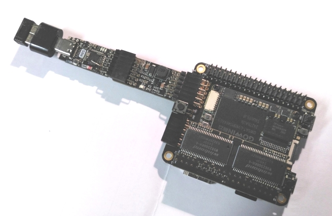

# MiSTeryNano on Tang Console 60K

MiSTeryNano can be used on the [Tang Console 60K](https://wiki.sipeed.com/hardware/en/tang/tang-console/mega-console.html).

The Tang Console 60K is bigger than most other boards supported my
MiSTeryNano.

The Tang Console comes with DDR3-SDRAM as well as a slot for the [Tang
SDRAM](https://wiki.sipeed.com/hardware/en/tang/tang-PMOD/FPGA_PMOD.html#TANG_SDRAM). Using
this board allows to use the same SDR-SDRAM memory access
methods. DDR3 on the other hand is not supported by regular retro
implementations like the MiSTeryNano.

The M0S required to control the MiSTeryNano is to be mounted in the
middle PMOD with the help of the [M0S PMOD adapter](board/m0s_pmod).

The whole setup will look like this:

The firmware for the M0S Dock is the [same version as for the Tang
Nano 20K and all other boards](https://github.com/harbaum/FPGA-Companion).

Since the Tang Console 60K needs a bigger portion of the available flash
memory space, the TOS ROMs need to be flashed to a different memory location
on the Console 60K. The flash locations to be used are:

| Address | TOS slot  |
|---------|-----------|
| 0x500000 | Primary ST TOS |
| 0x540000 | Primary STE TOS |
| 0x580000 | Secondary ST TOS |
| 0x5c0000 | Secondary STE TOS |
