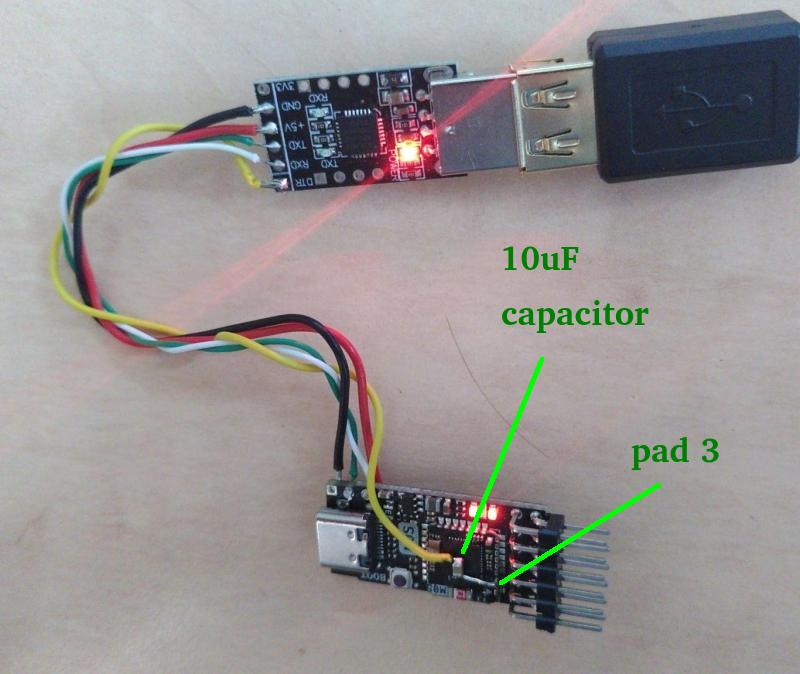

# BL616

The [Bouffalow Lab BL616](https://en.bouffalolab.com/product/?type=detail&id=25) is a Risc V microcontroller. It's comparable with the ESP32 and comes with integrated WiFi, Bluetooth, USB device, USB host and various other peripherals. In combination with a FPGA the BL616 can perform sopport tasks like handling SD card and their file systems or dealing with USB peripherals.

The Tang Nano 20k contains a [on-board BL616 MCU](https://en.bouffalolab.com/product/?type=detail&id=25) which is equipped with a firmware that emulates a [FT2232D](https://ftdichip.com/products/ft2232d/) to act as a USB debug and flash interface to the FPGA and its SPI flash.

Separate BL616 based boards like the [M0S Dock](https://wiki.sipeed.com/hardware/en/maixzero/m0s/m0s.html) are available which can be connected to the Tang Nano 20k. This can be helpful to avoid messing with the on-board BL616 of the Tang Nano 20K.

This directory contains:

  * [misterynano_fw](misterynano_fw) is the current firmware for use with MiSTeryNano. It's currently meant to be used with a seperate [M0S Dock/BL616](https://wiki.sipeed.com/hardware/en/maixzero/m0s/m0s.html) board and is not yet meant to be used with the internal BL616 of the Tang Nano 20k (read below for more details).
  * [usb_hid](usb_hid) is an early version of a BL616 firmware that acts as a USB host for USB keyboards and mice and translates their input data to the older PS2 protocol. It can be used to interface USB keyboards and mice to FPGA boards that expect PS2 keyboards and mice. Early versions of MiSTeryNano used it. This has been replaced by [misterynano_fw](misterynano_fw) and is still here for reference only.
  * [friend_20k](friend_20k) is the original firmware shipped with the BL616 in the Tang Nano 20k. It can be used to restore the BL616 to the factory state if e.g. [misterynano_fw](misterynano_fw) or [usb_hid](usb_hid) have been flashed onto the Tang Nano 20K's internal BL616 MCU. You'll need the [friend_20k_bl616.bin](https://raw.githubusercontent.com/harbaum/MiSTeryNano/main/bl616/friend_20k/friend_20k_bl616.bin) and its [config file](https://raw.githubusercontent.com/harbaum/MiSTeryNano/main/bl616/friend_20k/friend_20k_cfg.ini).

## BL616 on the Tang Nano 20K

The Tang Nano 20k comes with an ```UPDATE``` button which can be used to update or replace the firmware of the BL616. It is thus possible to repurpose the BL616 to provide custom functionality in conjunction with the FPGA.

There are several ways to cope with the fact that the on-board BL616 is responsible for updating the FPGA:

  * The Tang Nano 20k has JTAG solder pads and a external programmer can be connected to these pads and replace the update function usually provided by the on-board BL616
  * The on-board BL616 can be re-flashed with its original firmware whenever the FPGA is to be updated
  * A separate second BL616 can be connected to the Tang Nano 20k leaving the on-board one intouched

The [M0S Dock](https://wiki.sipeed.com/hardware/en/maixzero/m0s/m0s.html) contains the same BL616 MCU and can thus be used to develop a replacement firmware while keeping the BL616 on the Tang Nano 20k intact.

## Using the M0S Dock

The M0S Dock itself is a rather simple device and updating it requires the user to press the ```BOOT``` button (which acts identical to the ```UPDATE``` button on the Tang Nano 20k) while resetting/powercycling the board by un-plugging and re-plugging it to the PCs USB. Furthermore, the M0S Dock does not include a USB UART interface which would be handy for debug and console messages. While this might not be a problem for end users, it makes development slightly difficult.

Development can be eased a little bit by adding an external USB UART like the CP2102 to the M0S Dock. The M0S Dock has a few solder pads right beside the USB-C connector to access the UART Rx and Tx signals as well as GND. If the M0S Dock is also to be powered from the USB UART, then 5V from the USB UART needs to be connected to the expansion connector of the M0S Dock. Finally to avoid to have to un- and re-plug the board during update it's possible to connect another connection from pin3 of the embedded M0S module of the M0S Dock via a 10µF capacitor to the DTR line of the USB UART. This will reset the M0S Dock whenever the flash utility opens the serial connection for update. However, the ```BOOT``` button still needs to be pressed manually during update.



## Compiling and uploading code for the BL616

Compilation has only been tested under Linux.

Download the Bouffalo toolchain:

```
git clone https://gitee.com/bouffalolab/toolchain_gcc_t-head_linux.git
```

And the Bouffalo SDK:

```
git clone https://github.com/bouffalolab/bouffalo_sdk.git
```

Compile the firmware:

```
$ CROSS_COMPILE=<where you downloaded the toolchain>/toolchain_gcc_t-head_linux/bin/riscv64-unknown-elf- BL_SDK_BASE=<where you downloaded the sdk>/bouffalo_sdk/ make
```

### Flashing the firmware

The resulting binary can be flashed onto the M0S. You need to unplug
the M0S from USB, press the BOOT button and plug it into USB with the
BOOT button pressed. Once connected release the BOOT button. The device
should now show up with its bootloader on the PC:

```
$ lsusb
...
Bus 002 Device 009: ID 349b:6160 Bouffalo Bouffalo CDC DEMO
...
```

Also an ACM port should have been created for this device as e.g.
reported in the kernel logs visible with ```dmesg```:

```
usb 2-1.7.3.3: new high-speed USB device number 9 using ehci-pci
usb 2-1.7.3.3: config 1 interface 0 altsetting 0 endpoint 0x83 has an invalid bInterval 0, changing to 7
usb 2-1.7.3.3: New USB device found, idVendor=349b, idProduct=6160, bcdDevice= 2.00
usb 2-1.7.3.3: New USB device strings: Mfr=1, Product=2, SerialNumber=0
usb 2-1.7.3.3: Product: Bouffalo CDC DEMO
usb 2-1.7.3.3: Manufacturer: Bouffalo
cdc_acm 2-1.7.3.3:1.0: ttyACM3: USB ACM device
```

Once it shows up that way it can be flashed. If you have built the firmware yourself and have the SDK installed you can simply enter the following command:

```
BL_SDK_BASE=<where you downloaded the sdk>/bouffalo_sdk/ make CHIP=bl616 COMX=/dev/ttyACM3 flash
```

If you have downloaded the firmware from the [release page](https://github.com/harbaum/MiSTeryNano/releases) you can use the graphical [BLFlashCube too](https://github.com/bouffalolab/bouffalo_sdk/tree/master/tools/bflb_tools/bouffalo_flash_cube) tool usinfg the ```misterynano_fw_bl616_cfg.ini``` file.

After successful download you need to unplug the device again and reinsert it *without* the BOOT button pressed to boot into the newly installed firmware.

## MiSTeryNano Firmware

The [misterynano_fw](misterynano_fw) contains the BL616 code for the MiSTeryNano.
It connects the BL616 to the FPGA via a SPI connection and uses these to send
keyboard and mouse events into the FPGA core as well control commands for the
on-screen-display (OSD).

The MiSTeryNano Firmware is being used with MiSTeryNano V1.2.0 and later.

## USB HID

The [usb_hid](usb_hid) has been used up to version 1.1.0 of MiSTeryNano. It provided
PS2 like interfaces for keyboard and mouse. Later version switch to a SPI interface
for keyboard and mouse and also include more functionality including OSD control.
The [usb_hid](usb_hid) is here for reference and since other projects may have a use
for a simple and cheap USB/PS2 conversion.

### USB HID on M0S Dock

The [usb_hid](usb_hid) code lets the
[M0S Dock](https://wiki.sipeed.com/hardware/en/maixzero/m0s/m0s.html)
act as a USB host accepting USB keyboards and mice and converting their
signals into [PS/2](https://en.wikipedia.org/wiki/PS/2_port)
compatible signals as used by many retro computing FPGA cores to
interface to keyboards and mice.

A LED on the M0S Dock will light up, when a HID device is detected (e.g. a keyboard,
mouse or joystick). Keyboard signals will be sent via IO10 (CLK) and IO11 (DATA) and
mouse signals will be sent via IO12 (CLK) and IO13 (DATA). Furthermore GND and +5V have to
be connected to the Tang Nano 20k to power the M0S Dock and its attached USB devices.

See a demo video [here](https://youtube.com/shorts/jjps1x1NjhE?si=LUqlXd3iTG0hus1-).

This has been tested with several wireless keyboard/touchpad combo devices incl.
the Rii X1 and the Rapoo E2710.

### USB HID with the internal BL616 MCU of the Tang Nano 20k

While it's recommanded to use an external M0S Dock it's also possible to repurpose
the internal BL616 MCU to handle mouse and keyboard. This possibility is a work in progress and not every release of the firmware may be ready to be used on the internal BL616 MCU. 

Before compiling the new firmware as described above, the
```M0S_DOCK``` define has to be commented in
[usb_config.h](https://github.com/harbaum/MiSTeryNano/blob/ffd647f3c8f8406800e98a099cbf70ec7bcb20e8/bl616/usb_hid/usb_config.h#L9)
to make sure that the generated code works for the internal BL616 MCU.

Finally the BL616 MCU is re-flashed with the USB HID firmware. This way you'll
loose the ability to flash the FPGA! Before being able to re-flash the FPGA
you need to re-install the original firmware. The original firmware is available [here](friend_20k).
