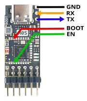
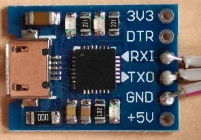
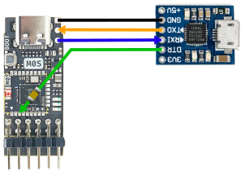
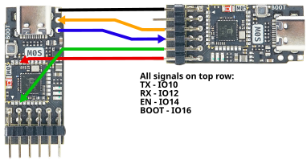

# M0S Debugger

The [M0S Dock](https://wiki.sipeed.com/hardware/en/maixzero/m0s/m0s.html) is a
neat little yet powerful Risc-V development board. It can be flashed
via USB using its on-board USB connector. For this purpose its
bootloader needs to be activated. This happens by pressing its
```BOOT``` button and keeping it pressed while powering the board up,
e.g. by plugging its USB cable into a PC.

Once in bootloader mode it can be updated using the
[Bouffalo Flash Cube software](https://github.com/bouffalolab/bouffalo_sdk/tree/master/tools/bflb_tools/bouffalo_flash_cube).

This approach is usually fine for an end user who only needs to update
the firmware every now and then. It's cumbersome to use this approch
during development.

# The M0S Dock's UART interface

The M0S Dock includes three unused connection pads right beside its
USB-C connector. Two of these pads are round and labeled R and T and
the third one is square. The square PAD is a GND pad and forms a
UART interface together witr the R(eveive) and T(transmit) pads. These
three pads may e.g. connected to a USB-UART board. You need to be
careful with the data directions. The M0S Dock's T(transmit) pin may
need to be connected to the USB-UARTs receive pin (Rx, RxD or similar)
and vice versa.

This allows to send and receive data from and to the M0S to e.g. a
PC for debugging purposes. By default this interface operates at
2000000 bit/s. This is too fast for many cheap USB-UARTs. When using
the [Bouffalo SDK](https://github.com/bouffalolab/bouffalo_sdk)
this can be adjusted [here](https://github.com/bouffalolab/bouffalo_sdk/blob/be623ceb7f18c70f3aafba2a0eceba5efc6a683a/bsp/board/bl616dk/board.c#L237) and
[here](https://github.com/bouffalolab/bouffalo_sdk/blob/be623ceb7f18c70f3aafba2a0eceba5efc6a683a/bsp/board/bl616dk/board.c#L247). With a cheap CP2102
USB-UART adaptor I had to reduce this to 921600 bit/s to get debug output.

The M0S Dock will use this output by default and will print some
debug information on startup:

```
  ____               __  __      _       _       _     
 |  _ \             / _|/ _|    | |     | |     | |    
 | |_) | ___  _   _| |_| |_ __ _| | ___ | | __ _| |__  
 |  _ < / _ \| | | |  _|  _/ _` | |/ _ \| |/ _` | '_ \ 
 | |_) | (_) | |_| | | | || (_| | | (_) | | (_| | |_) |
 |____/ \___/ \__,_|_| |_| \__,_|_|\___/|_|\__,_|_.__/ 

Build:12:01:48,Feb 11 2024
Copyright (c) 2022 Bouffalolab team
======== flash cfg ========
flash size 0x00400000
jedec id     0xC86016
mid              0xC8
iomode           0x04
clk delay        0x01
clk invert       0x01
read reg cmd0    0x05
read reg cmd1    0x35
write reg cmd0   0x01
write reg cmd1   0x01
qe write len     0x02
cread support    0x01
cread code       0x20
burst wrap cmd   0x77
===========================
dynamic memory init success, ocram heap size = 394 Kbyte 
sig1:ffffffff
sig2:0000f32f
cgen1:9ffffffd
```

Any output e.g. done with ```printf()``` in the application will
also appear there.

This is fine for simple debugging but to download the firmware you
still need to unplug and replug USB while pressing the ```BOOT```
button.

## Automatic reset

It would be convenient if the device had a reset button as on reset
the device will also check the ```BOOT````button state. Thus the
device can also be brought into bootloader mode by keeping the
```BOOT``` button pressed while resetting the device.

The reset signal on the M0S Dock is called ```EN``` and is
unfortunately not available on any exposed pins or pads. Instead it's
only available on one of the contact pins of the embedded M0S on the
M0S Dock. So is the ```BOOT``` signal:



Coincidentally most USB-UART bridge chips like the CP2102
have two additional output signals named DTR and RTS. These are meant
to implement additional control lines on a real RS232 link (RTS =
Ready To Send, DTR = Data Terminal Ready). Both signals are driven
high by default and usually go low while the serial connection is
open:

```
     idle        connection open          idle 
      ___                                _______
DTR      \____________ ... _____________/      
      ______                                ____
RTS         \_________ ... ________________/      
```

### How BouffaloLabs meant to do it

Bouffalo obviously decided to use these signals to control BOOT and EN
in order to allow a full automatic update. The RTS/DTR signal flow
during a flash cube run looks like this:

```
            set 
     idle   500k                            sync/flash 
      ___         ______________ ... __________ ... _________
DTR      \_______/      
      ______        _____      _ ... _      ___ ... _________
RTS         \______/     \____/       \____/
```

DTR is meant to drive the ```BOOT``` signal and is driven high
during sync/flash of the Bouffalo flash cube software to indicate
that the bootloader is to be activated. RTS is driven low a few
times and since it's supposed to act as the ```EN``` signal it
resets the target device a few times forcing it into bootloader
mode.

*The problem:* In regular use with a standard terminal application RTS
is driven low while the connection is open. When RTS is used as a
reset driving the ```EN``` signal on the M0S Dock, the device will be
kept in reset state while the terminal is open.  The device would not
run and no output would be seen. This is not useful. A special
terminal program may be used to control the RTS line appropriately,
but I'd like to use standard software without having to care for
special operation modes.

Furthermore the RTS signal is not exposed on the pins on many cheap
CP2102 uart adapters:



### Simple CP2102 solution

With only a few cheap CP2102 adapters on hand the DTR line was the
only signal available to support flashing the M0S.  Connecting DTR
directly to the ```EN``` pin would keep the device in reset while
using a terminal. This is not useful, Adding a 10µF capacitor into the
connection between the CP2102 and the M0S makes the ```EN``` signal
only become active for a short moment after the DTR signal falls.
This would generate a short low reset pulse on ```EN``` at the
beginning of a flash cube session or when a terminal program is
being opened. The resulting setup looks like this:



The resulting solution triggers a M0S reset before any use of the
flash cube software or a regular terminal. The ```BOOT``` signal
is not driven by the UART and has still to operated manually using
the button.


Flashing thus required the user to press the ```BOOT``` button
before starting the flash cube software and keeping it pressed
until the flash has succeeded.

### Fully automatic solution using a second M0S Dock

Using the CP2102 or similar comes with a few
limitations. Interestingly the M0S itself brings everything needed to
use it as a USB UART itself.  A second M0S Dock may thus be used to
replace the CP2102 at minimal additional costs. This has two
advantages. Firstly the additional M0S is able to operate at the
full 2000000 bit/s the Bouffalo SDK uses by default. And secondly
the M0S has full control over the incoming USB requests to control
the DTR and RTS lines and can these in any to control ```BOOT``` and
```EN``` as depicted below:



The M0S on the right acts as the USB UART converter, the one on the
left is the target to be programmed and debugged. A few resistors
(e.g. 33 Ohms) can optionally be included into the four control signals
to reduce the risk of damage in case of a short circuit.


The debugger M0S needs to be flashed itself with a custom firmware
provided in the repository. This firmware mainly consists of the
[Sipeed CDC ACM UART soluition](https://github.com/sipeed/M0S_BL616_example/tree/main/sipeed/solutions/usbd_cdc_acm_with_uart). It
maps the UART TX/RX to ```IO10``` and ```IO12``` on the M0S Docks pin
header. Additionally ```EN``` and ```BOOT``` are mapped to ```IO14```
and ```IO16```.  Unlike the CP2102 solution ```EN``` and ```BOOT```
are not directly mapped to the DTR and RTS signals. Instead a
full bootloader startup sequence is initiated on ```EN``` and ```BOOT``` whenever
the M0S detects that RTS falls while DTR is high. This only happens in the
startup sequence of the cube flasher. The M0S then monitors UART/serial
activity until it sees a second of silence. It takes this is an indicator
that the flash process has ended and will then intiate the sequence
on ```EN``` and ```BOOT``` required to reset into normal application execution.

The result is a fully automatic flash setup. The Bouffalo flash cube software
can be used to flash the target M0S without any further user interaction
and a regular terminal software can be used to monitor the serial output
of the target M0S during runtime.

 