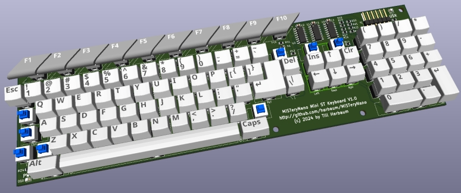

# MiSTeryNano - Mini ST keyboard

This is a work in progress. It's meant to become a half size keyboard
inspired by the Atari ST series. It's meant to become the basis
of some kind of Mini Atari ST based on the MiSTeryNano FPGA.

They keyboard is primarily designed to be a fully functional design
suited for simple use cases like renaming a file or selecting game
options. It's not meant to be usable to write texts or for any other
productive use case.

## Hardware

The [hardware](pcb) consists of cheap 7x7mm 6 pin momentary switches. These
switches are arranged in the same 15*8 matrix used inside the original
Atari ST keyboard.

The matrix is addressed via serial shift registers requiring four pins
on the controlling device. Two 8-bit serial to parallel shift
registers are used to drive the 15 columnns and a single serial to
parallel shift register is being used to read the eight rows. For
further info on reading the matrix via the serial interface refer
to the [kbd_test Arduino test sketch](kbd_test). The 16th output of
the serial shift registers drive a user conrollable LED in the top right
corner similarily placed to the floppy LED on a Atari STF. This might e.g.
be used in an emulation environment to indicate disk/sd card activity.

The keyboard can either be driven by 3.3V or by 5V and is thus compatible
with nearly all microcontrollers as well as many consumer FPGAs.

## Keycaps

The keycaps have been designed to be printable on a Bambulab Carbon X1
using a 0.4mm nozzle, 0.8mm layer height and two colors of PETG filament.

The keycaps are being designed in FreeCAD using a small macro script
to derive the various variants from a small set of designs. This also
exports [STL files](stl) for printing as well as [WRL files](wrl) for
rendering in kicad.
