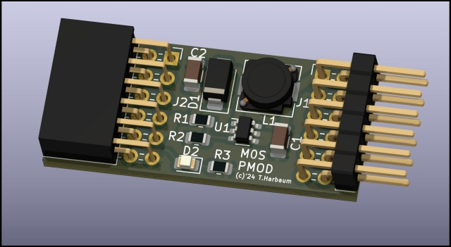
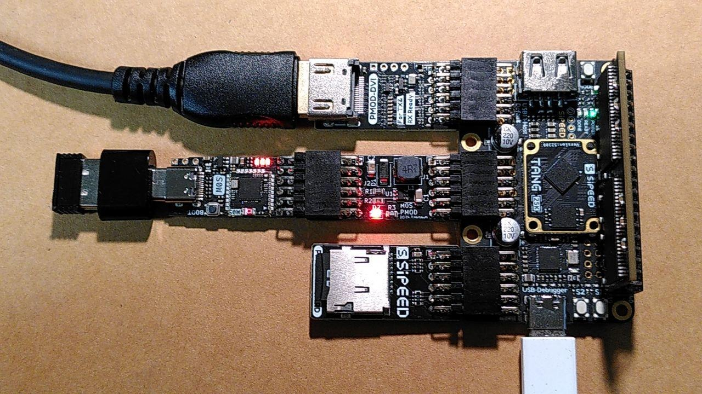
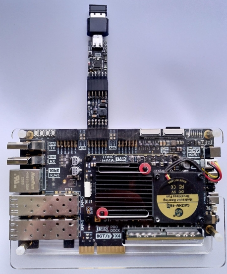
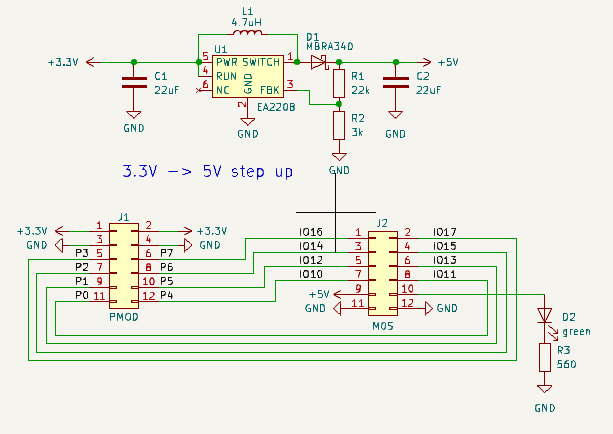

# M0S PMOD

The M0S PMOD adapter connects a  [M0S Dock](https://wiki.sipeed.com/hardware/en/maixzero/m0s/m0s.html) to any FPGA board with PMOD ports.

The M0S PMOD can e.g. be used with the [Tang Primer
25K](https://wiki.sipeed.com/hardware/en/tang/tang-primer-25k/primer-25k.html) or
the [Tang Mega 138K](https://wiki.sipeed.com/hardware/en/tang/tang-mega-138k/mega-138k-pro.html). This
may e.g. be used to run the MiSTeryNano firmware on the M0S Dock and
to give the MiSTeryNano core running on the Tang Primer 25K advanced
USB host capabilites, the On-Screen-Display and all file system
handling needed.

The device is rather simple and mainly consists of a 3.3V to 5V boost
converter prividing 5V to the M0S Doch from the 3.3V available on the
PMOD connector. While the M0S itself runs on 3.3V, the 5V are needed
for the M0S Dock to provide powre to the USB port when acting as a USB
host. The LED is powered from the 3.3V returned by the M0S Dock and
will indicate that the M0S Dock is properly powered.

[PDF](m0s_pmod_schematic.pdf)

## Production data

Complete production data for the JLCPCB PCBA service is [included](jlcpcb).