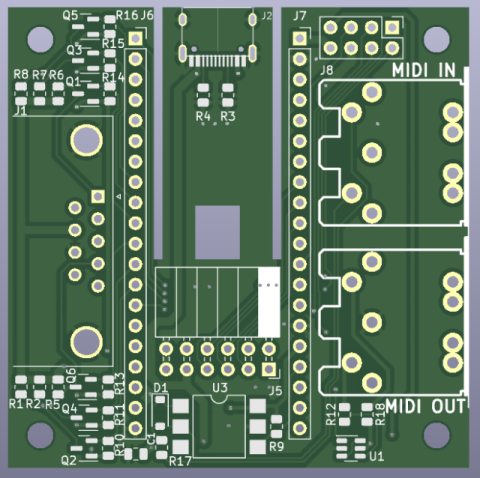
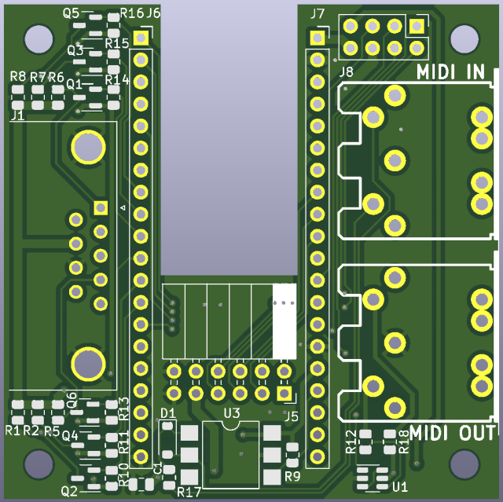
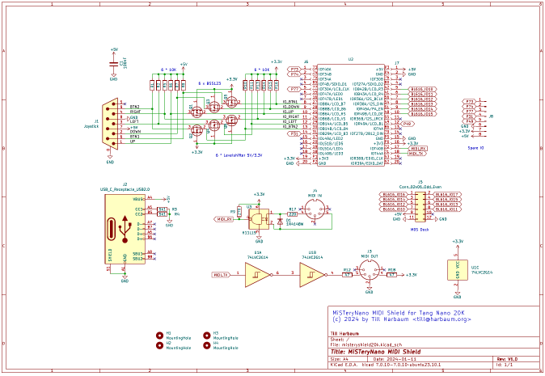

# MiSTeryNano MIDI shield for Tang Nano 20k

This is a base board for the Tang Nano 20K and optionally the M0S Dock.
It features:

  * Headers to plug the Tang Nano 20K
  * A seperate USB power supply (old variant only)
    * Used if the Tang Nano 20K is being used as a USB host itself
    * Can be broken off to make room for a M0S Dock
  * M0S Dock connector
  * Atari style joystick
    * Supports two buttons
    * Including 5V supply and 5V level shifters
    * Works with DB9 joystcks and mice
  * MIDI
    * MIDI OUT with driver chip to protect Tang Nano 20K
    * MIDI IN with optocoupler to protect Tang Nano 20K

PCBA production files for JLCPCB are availble [here](jlcpcb).

## Variants

There are now two variants of the board:

  * The original variant including a small PCB breakout with a USB-C
  connector. This variant could theoretically be used without M0S
  Dock. But in fact the M0S Dock is currently needed by many cores and
  the USB-C part needs to be cut off to make space for the M0S
  Dock. However, it turned out that some people damage the PCB in the
  process of cutting this part off. That's why the second M0S variant
  now exists.
  
  * The M0S variant does not include the USB-C part and can only be
  used in conjunction with a M0S Dock. This is the preferred version
  as nothing has to be cut to use it. However, this variant has not
  been tested, yet. No problems are expected, but please report back
  if you successfully order and use one of these.
  

 

The part carrying the USB connector can be cut away making room for a
M0S Dock which will then also be used to provide power to the Tang
Nano 20K.

[PDF](misteryshield20k.pdf)