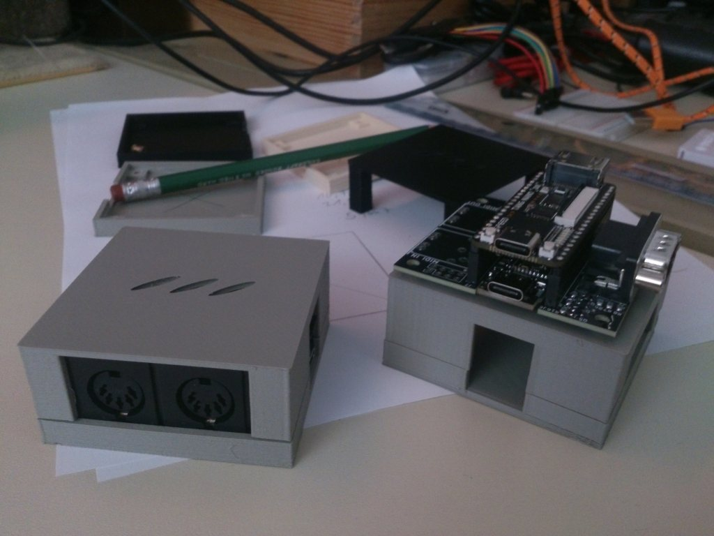

# 3D Housing for the MiSTeryNano20k shield

This is a simple housing consisting of a base and a lid.

There are two versions of both components. There are versions of the lid with or without a hole for the MIDI ports and versions of the base with and without a support for the M0S dock.
The M0S support base should prevent the removal of USB devices pulling the M0S dock from its slot.

You can fasten the case using 4x 12mm M3 screws but these are optional.

This housing is licensed under the [CC BY-NC-SA 4.0](https://creativecommons.org/licenses/by-nc-sa/4.0/)

