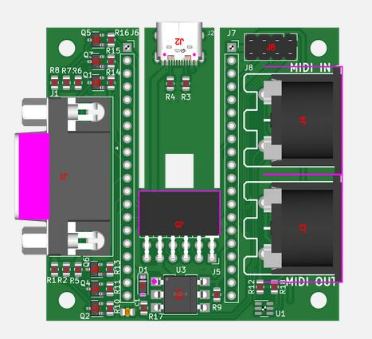

# JLCPCB production data for MiSTeryNano MIDI shield

These files can be uploaded to [JLCPCB](https://jlcpcb.com/) in order
to have this board produced through their PCBA service (fully
assembled and ready to run).

To order the old variant please use the files:
 - [gerber.zip](gerber.zip) containing the PCB data itself
 - [bom.csv](bom.csv) containing the parts (BOM) to be placed on the PCB	
 - [positions.csv](positions.csv) containing placement (CPL) information for the parts

For the new version please use:
 - [gerber_m0s.zip](gerber_m0s.zip) containing the PCB data itself
 - [bom_m0s.csv](bom_m0s.csv) containing the parts (BOM) to be placed on the PCB	
 - [positions_m0s.csv](positions_m0s.csv) containing placement (CPL) information for the parts

If in doubt, please order the new version. Please read [here](../README.md) about the two variants.

Remark: Early versions of these files had a 2k7 resistor for R9
instead of a 270 ohms one. If you had your board produced by JLCPCB then
you probably have the wrong resistor. Luckily, the wrong resistor is
very unlikely to be a problem and receiving MIDI data should still
work perfectly even with the wrong resistor.

JLCPCB does not have 3D models for all components and J6, J7 and U1
are only rendered as small blocks in their production preview:

The produced devices will still be complete with all components being
properly mounted.
