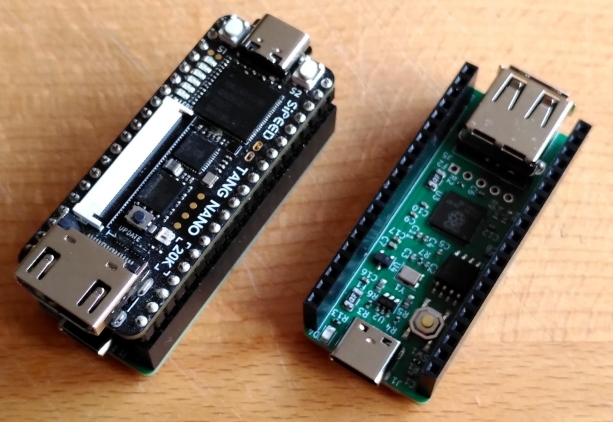
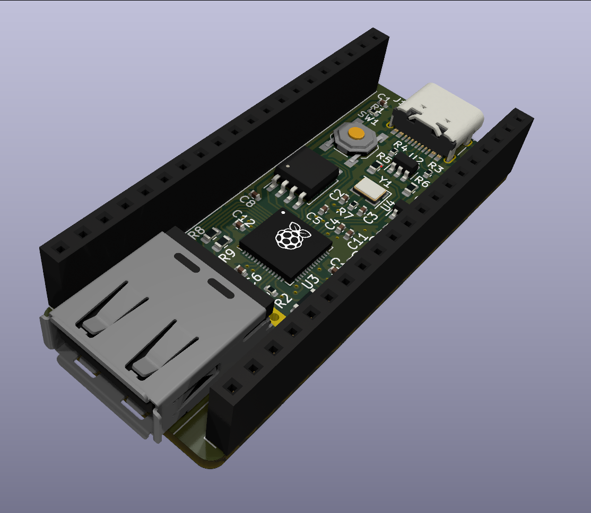
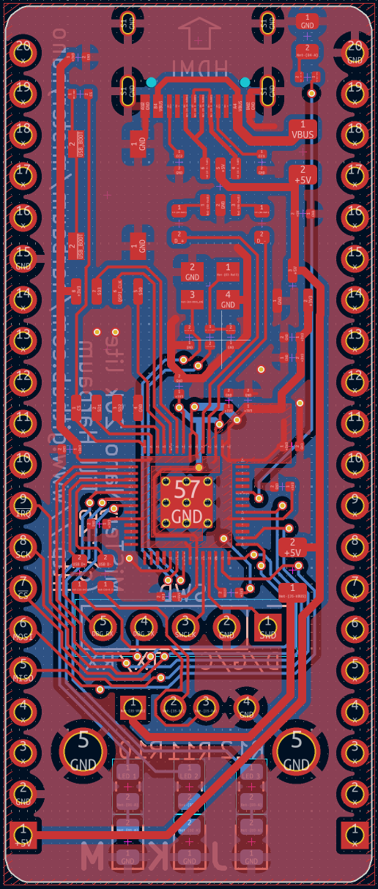
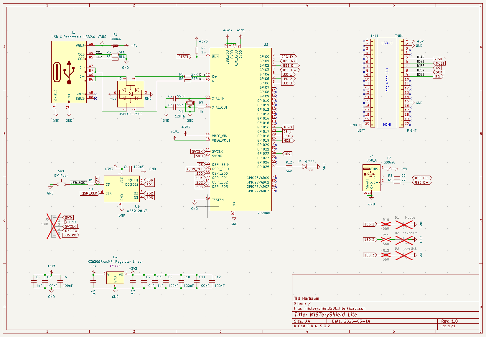
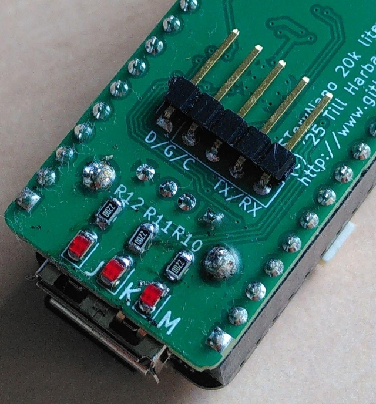

# Minimalistic MiSTeryNano Shield for Tang Nano 20k

This is a minimalistic base board for the Tang Nano 20K.
It features:

  * Headers to plug the Tang Nano 20K
  * Integrated RP2040 intended to run the [FPGA Compantion firmware](https://github.com/harbaum/FPGA-Companion).
  * A USB-A host port
  * A USB-C port for flashing and/or power supply

PCBA production files for JLCPCB are availble [here](jlcpcb).

The board design was in inspired and is partly based on
[this RP2040 design guide](https://github.com/calliah333/RP2040-designguide).

## Flashing the FPGA Companion firmware

The RP2040 comes unprogrammed and the board will show up as a flash
drive to be programmed.  A slightly customized firmware is needed
since this board does not allow to detect the presence (or absence in
this case) of the WiFi module. Furthermore, the oscillator used needs
some slight firmware adjustment to make the board reliably.

The necessary firmware changes can be [enabled using a build option](https://github.com/harbaum/FPGA-Companion/tree/main/src/rp2040#using-the-misteryshield20k-lite). After
flashing this firmware the green LED next to the USB-C connector
should start flashing.

The board contains a BOOT button for later flashing just like any
other Raspberry Pi Pico.

## Power options

The setup can either be powered from the shields own USB-C connector
or from the USB-C connector of the Tang Nano 20k. This gives some
flexibility when using HDMI adaptors or USB hubs plugged directly into
the Tang Nano 20K or the shields USB-A port.

[PDF](schematic.pdf)

## Optional components

The board has footprints for three unpopulated 0805 LEDs with related
560 ohms resistors on the PCBs bottom. These can be populated and will
indicate the presence of USB mouse, keyboard and joystick.

Finally, a unpopulated 5 pin connector carries the SWD signals as well
the the UART RX/TX signals and can be populated for convenient
firmware development and debugging. This is designed to use a right
angle pin header mounted on the bottom side.

