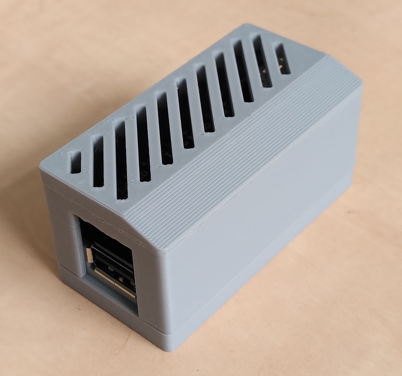

## A simple case for the [MiSTeryNano Lite](https://github.com/harbaum/MiSTeryNano)

This housing consists of several parts: a bottom, the top, a lid ("toptop") for different computer designs and a badge for the respective design (yet incomplete).

The STL files you can find here are ready for processing them in your preferred slicer software.  
The sources of all parts of the housing can be found inside the *scad* folder. You'll need the [OpenSCAD](https://openscad.org) software to process and to render them. Fonts and logos are located in a subfolder of *scad*  

Please respect all licenses which are mentioned in the OpenSCAD sources.

Changelog:
- 2025/06/18 - The first run for Atari ST/E, Apple IIe, Commodore C64 and Amiga
