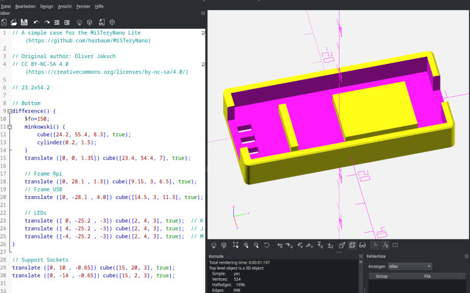
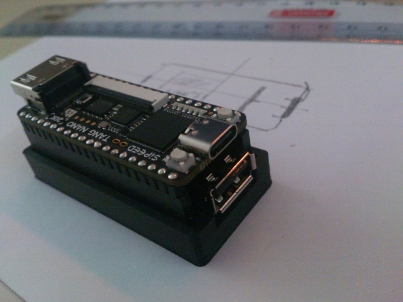
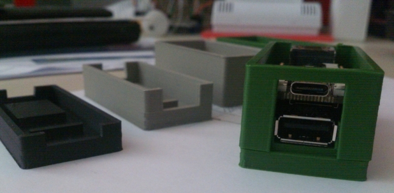
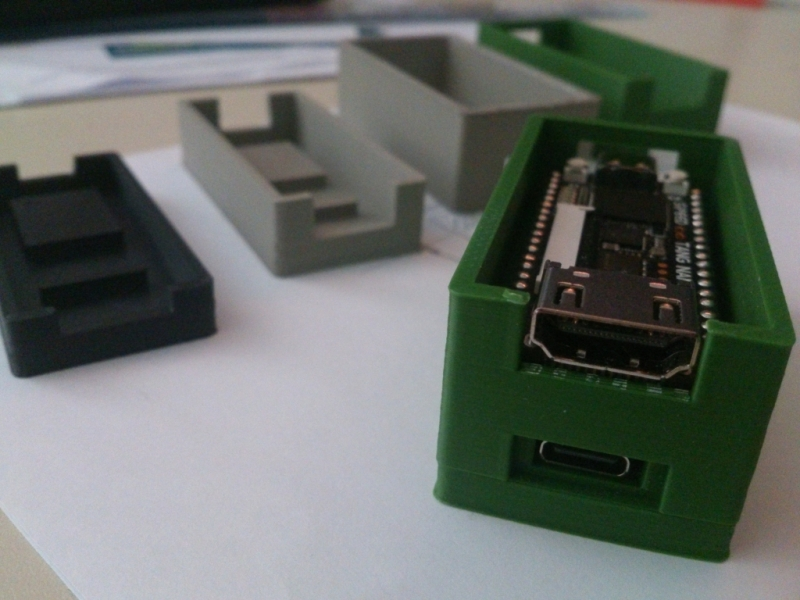
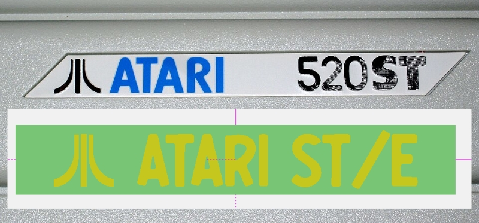
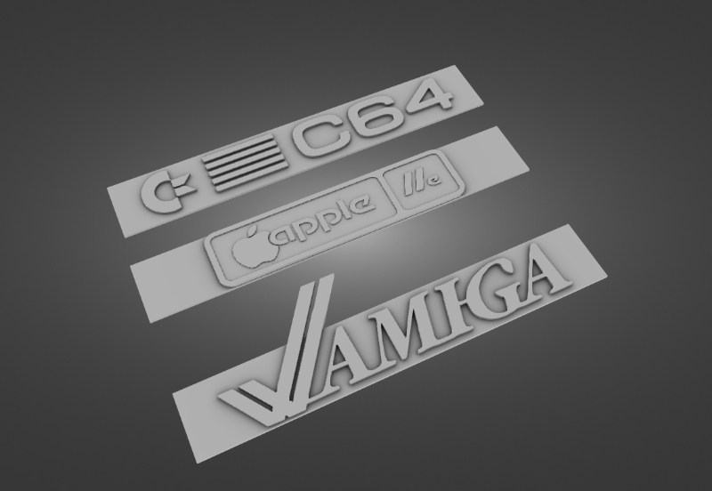
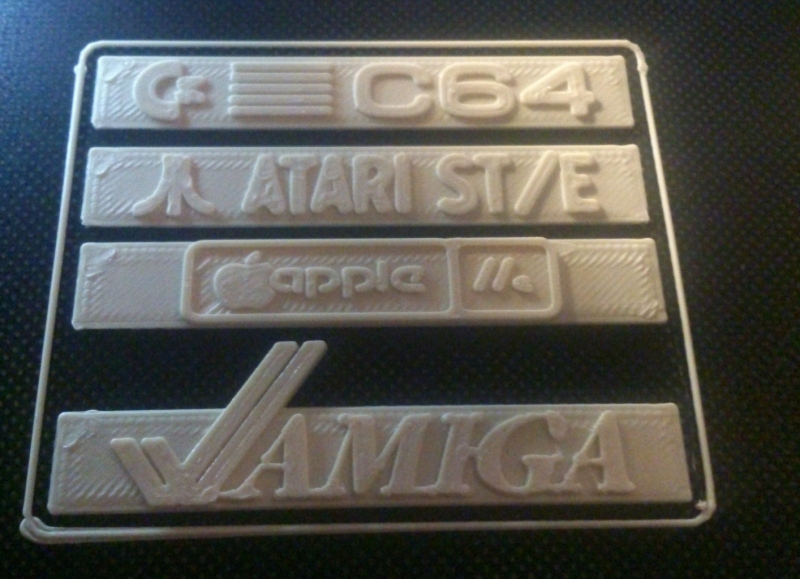

## This is a short kind of *The making of a simple case*  

I'm an old child who loved to play with wooden building blocks back in my childhood. 50 yrs later I love to play with virtual blocks! I'm using the fabulous [OpenSCAD](https://openscad.org) to achieve this (also available with batteries and [support for 3D glasses](https://github.com/koendv/openscad-raspberrypi).

Measure the PCB and start with a ground plate. Place walls around it. Look where to place holes and support blobs.

Print that and check if PCB fits fine...  
You can see an outlined plate on the paper and a ruler. This can help  a lot to reduce the required test prints to only one.

Some iterations and ideas later:

I'm skipping to the end of the process. You can have an idea what has changed between the photos and code.  
Of course we would like to have a badge for our model!

This is what they *could* look like:

Well, okay, not *that* bad!

This is **really** a simple task and done in a few hours.  
Thanks for watching! I'd love to see your results!
