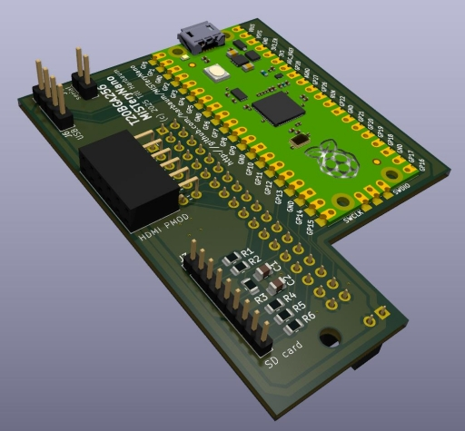
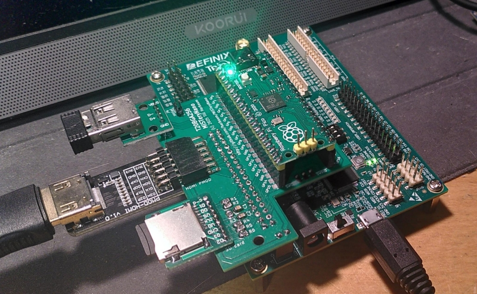
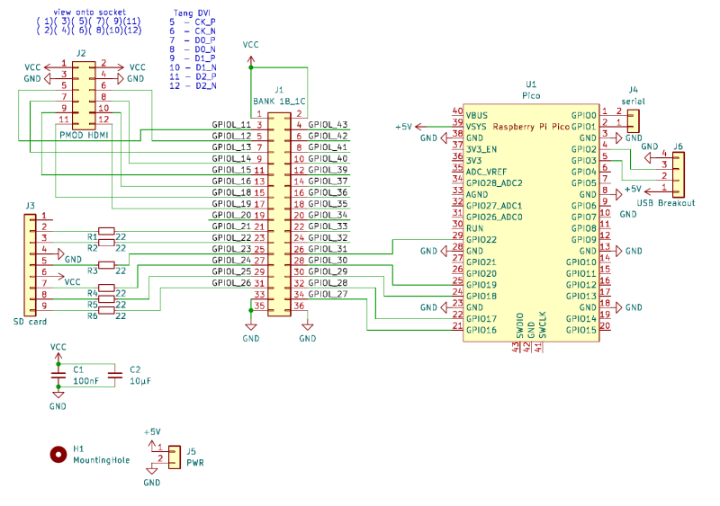
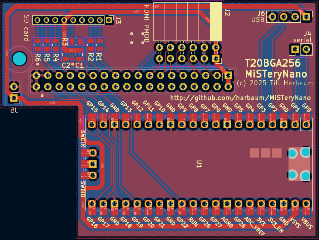

# T20BGA256 MiSTeryNano PMOD



This is an add-on for the [Efinix T20BGA256 development board](https://www.efinixinc.com/products-devkits-triont20.html). It adds all components needed for a complete MiSTeryNano setup.

  * SD card slot
  * PMOD connector for use with HDMI PMOD
  * Raspberry Pi PICO
  * USB-A host connector

The board plugs into the ```Bank 1B_1C``` header.



## Components

The following additional items are required:

  * [```Sipeed DVI PMOD```](https://wiki.sipeed.com/hardware/en/tang/tang-PMOD/FPGA_PMOD.html), ```iCESugar HDMi PMOD``` or similar
  * [USB-A](https://de.aliexpress.com/item/32888479323.html)
  * [SD-card breakout](https://de.aliexpress.com/item/32799352825.html)
    * 5x 22ohms 0805 resistors
    * 1x 100nF and 1x 10uF 0805 capacitor
  * 90 degree 2x06 pin 2.54mm socket (PMOD connector)
  * 1x02 and 2x18 pin 2.54 pin socket (to plug into the bank header)
  * some 2.54mm pin headers or wires

## Design files

The board was designed with KiCAD. Ready to used gerber files
are [provided as well](t20_pmod_gerbers.zip).



[PDF](t20_pmod.pdf)

